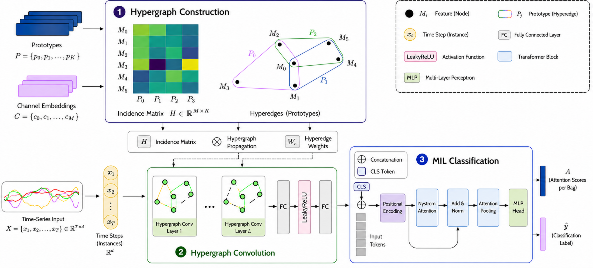

<div align="center">

<h1>HyperMIL: Hypergraph-based channel reasoning for Multiple Instance Learning on Multivariate Time Series</h1>

<p>
  <strong>Livia Del Gaudio</strong><sup>1</sup>&emsp;
  <strong>Vittorio Cuculo</strong><sup>1</sup>&emsp;
  <strong>Rita Cucchiara</strong><sup>1</sup>&emsp;
</p>

<p>
  <sup>1</sup>University of Modena and Reggio Emilia &emsp;
</p>

<p><strong>ICPR 2026</strong></p>

<p>
  <a href="https://github.com/aimagelab/HyperMIL"></a>
  <a href="https://github.com/aeon-toolkit/aeon"></a>
  <a href="#license"></a>
</p>



*HyperMIL is a Multiple Instance Learning framework for multivariate time series classification that explicitly models channel interactions through learnable hypergraphs. Higher-order relationships among variables are captured through prototype-driven hyperedges and further integrated within a temporal MIL architecture which ensures inherent interpretability.*

</div>

---


## 📌 Overview
HyperMIL is a modular MIL pipeline for multivariate time-series classification that combines:

1. **Intra-sample channel reasoning** with a channel-level hypergraph encoder.
2. **Temporal aggregation** with a transformer-like MIL head (Nyström attention).

This design enables multiple levels of interpretability by design: prototype-channel affinities reveal latent variable groupings, hypergraph structures expose higher-order dependencies, and temporal attention highlights discriminative intervals driving the final prediction. Overall, HyperMIL introduces a principled and extensible approach to structured reasoning in multivariate time series, unifying hypergraph learning and MIL under a single framework.


## ✨ Highlights
- HyperMIL is the first MIL framework that leverages hypergraph reasoning to capture high-order channel dependencies in multivariate time series.
- Data-driven hypergraph construction using latent prototypes enables the discovery of complex channel groupings directly from raw data (no domain-specific prior knowledge needed).
- Evaluation on multiple benchmark MTS datasets shows that HyperMIL outperforms state-of-the-art MIL and temporal deep learning baselines in both classification accuracy and model interpretability.

## 🧐 Project structure

```text
HyperMIL/
├── main.py                  # CLI entrypoint for training on aeon datasets
├── train_model.py           # training/evaluation loops and metrics
├── lookhead.py              # Lookahead optimizer wrapper
├── utils.py                 # IO/logging/reproducibility helpers
├── requirements.txt
└── models/
    ├── hypermil.py
    ├── channels_hypergraph.py
    ├── timemil.py
    ├── nystrom_attention.py
    └── common.py
```

## ⚙️ Installation

```bash
pip install -r requirements.txt
```

PyTorch should be installed separately to match your CUDA version — see the [official instructions](https://pytorch.org/get-started/locally/). The code requires `torch>=1.13`.

## 💡 Quick start

Data is loaded directly from the [aeon](https://www.aeon-toolkit.org/) time-series library — no manual download required.

```bash
python main.py --dataset PenDigits --num_epochs 50 --batchsize 64 --encoding wavelet --pooling cls
```

### Main CLI arguments

- `--dataset`: aeon dataset name (train/test split fetched automatically)
- `--num_epochs`, `--batchsize`, `--lr`, `--optimizer`, `--scheduler`
- `--encoding`: `wavelet | sinusoidal | none`
- `--pooling`: `cls | mean | max | attention | conjunct`
- `--k_prototypes`, `--num_convs`, `--tau`, `--intra_embed`, `--embed`
- `--seed`: random seed for reproducibility (default: `0`)
- `--save_dir`: checkpoint output directory (default: `./savemodel/`)


### Current scope

This release version targets aeon-based equal-length classification workflows while preserving support paths for variable-length collation in the training utilities.

## 🙏 Acknowledgements

This work builds on [TimeMIL](https://github.com/xiwenc1/TimeMIL) by Chen et al. — we thank the authors for releasing their code, which we used as the foundation for the temporal MIL head in this repository. 

## 📚 Citation

If you use this code, please cite:

```bibtex
@inproceedings{del2026hypermil,
  title={HyperMIL: Hypergraph-based channel reasoning for Multiple Instance Learning on Multivariate Time Series},
  author={Del Gaudio, Livia and Cuculo, Vittorio and Cucchiara, Rita},
  booktitle={Proceedings of the 28th International Conference on Pattern Recognition},
  year={2026}
}
```


---

## License

This dataset is released under the [Creative Commons Attribution-NonCommercial 4.0 International (CC BY-NC 4.0)](https://creativecommons.org/licenses/by-nc/4.0/) license.

You are free to share and adapt the material for **non-commercial research purposes only**, provided appropriate credit is given.

